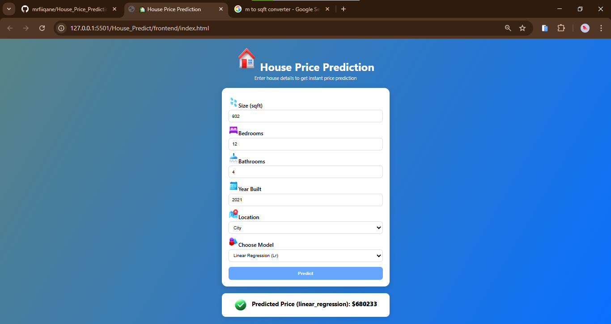
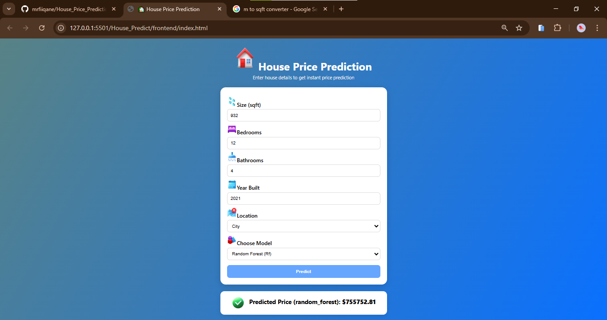

# 🏠 House Price Prediction

*Machine Learning Project to Predict House Prices*

---

## 📖 Description

project gan waa predict house prices based on features such as square, number of bedrooms, bathrooms, year built, and location

waxan ku toobaray **Linear Regression** and **Random Forest** models kadibna waxan ku xiray frontend HTML, CSS, JS

##### tijabo:

 

## - 📊 Dataset

- data waa clean waana la  preprocessed gareyey
- ku  saved gareyey: `dataset/house_l0000_Clean_dataset.csv`

---

## 🧾 Features

Main features used for prediction:

| Feature            | Description                                    |
| ------------------ | ---------------------------------------------- |
| Size_sqft          | cabirka ku fadhiyo                             |
| Bedrooms           | tirada qolalka                                 |
| Bathrooms          | tirada suuli yada                              |
| YearBuilt          | sanadka la dhisay                              |
| Location           | meesha u ku yaal (City, Suburb, Rural)        |
| HouseAge           | inta sano uu jiro gurigaas ma cusayb mise duug |
| Rooms_per_1000sqft | celceliska qolalka                             |
| Size_per_Bedroom   | cabirka qolalka                                |
| Is_City            | magaalo ma ku yaal ? (1=City)                  |

## 🤖 Models

waxan ku toobaray:

- **Linear Regression** 
- **Random Forest Regressor**

**Saved models:**

- `modeles/lr_model.joblib`
- `modeles/rf_model.joblib`

---

## 🧹 Preprocessing Steps

1. **Handling missing values (sixida waxa maqan ):**
   - Size_sqft → median
   - Bedrooms → mode
   - Location → mode
2. **Remove duplicates(ka saar waxa 2 jeer so labtay)**
3. **IQR capping** for Price and Size_sqft
4. **One-hot encoding** for Location
5. **Feature engineering:** HouseAge, Rooms_per_1000sqft, Size_per_Bedroom, Is_City
6. **Feature scaling:** StandardScaler applied to numerical features

---

## 📈 Evaluation

- RMSE
- MAE
- R² Score

---

## 🚀 Usage

### Run via API

Start Flask API:

###### Send POST request

http://localhost:8000/predict?model=lr
http://localhost:8000/predict?model=rf

###### Example JSON input:

{
  "Size_sqft": 2000,
  "Bedrooms": 3,
  "Bathrooms": 2,
  "YearBuilt": 2010,
  "Location": "City"
}

###### Example response:

{
  "model": "linear_regression",
  "prediction": 230000.0
}

{
  "model": "random_forest",
  "prediction": 250000.0
}
